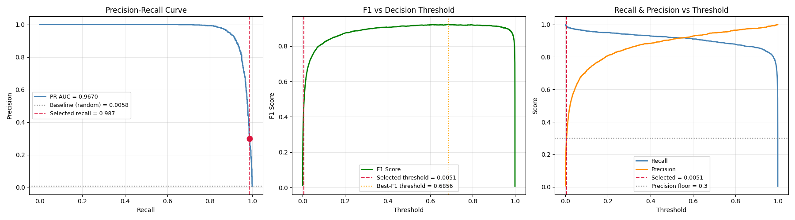

# FraudGuard — Real-Time Credit Card Fraud Detection

> A production-style, two-layer fraud detection system combining a **Java rule engine** with an **XGBoost ML model** trained on 1.85M transactions, featuring AML compliance rules, graph-based money laundering detection, and a real-time REST API.


---

## Table of Contents

- [Overview](#overview)
- [Results](#results)
- [Architecture](#architecture)
- [Features](#features)
- [Tech Stack](#tech-stack)
- [Quick Start](#quick-start)
- [API Reference](#api-reference)
- [ML Pipeline](#ml-pipeline)
- [Rule Engine](#rule-engine)
- [Risk Scoring](#risk-scoring)
- [Acknowledgements](#acknowledgements)

---

## Overview

FraudGuard is a full-stack fraud detection system that processes credit card transactions through two independent layers:

1. **Rule Engine (Java)** — Acts as the first layer that contains hardcoded rules that check for fraud 
2. **ML Model (Python)** — XGBoost classifier trained on 1.85M transactions with 15 engineered features, served via FastAPI

Both layers run on every transaction. If the Python service is unavailable, the rule engine continues operating independently.

Transactions can be submitted as a **single object or a JSON array** through the same endpoint, and are evaluated for high-amount violations, structuring, improper frequency, graph-based money laundering cycles, and ML-detected anomalies simultaneously.

---

## Results

| Metric | Value |
|---|---|
| **PR-AUC** | **0.967** |
| **F1 Score** (threshold=0.686) | **0.922** |
| **Recall** | **98.7%** — 1,482 / 1,501 fraud cases caught |
| **Precision** | 94.9% at best-F1 threshold |
| False Alarms | 72 on 257,834 legitimate transactions |
| Training samples | 1,852,394 transactions |
| Fraud rate | 0.58% (class imbalance handled with SMOTE) |


### Evaluation Plots




### Threshold Tradeoff

| Threshold | Precision | Recall | F1 | Caught | False Alarms |
|---|---|---|---|---|---|
| 0.10 | 0.715 | 0.960 | 0.820 | 1441/1501 | 574 |
| 0.20 | 0.808 | 0.951 | 0.874 | 1427/1501 | 338 |
| 0.30 | 0.856 | 0.939 | 0.896 | 1410/1501 | 238 |
| 0.50 | 0.908 | 0.919 | 0.914 | 1380/1501 | 140 |
| **0.69** | **0.949** | **0.894** | **0.921** | **1342/1501** | **72** |
| 0.80 | 0.965 | 0.877 | 0.919 | 1317/1501 | 48 |

---

## Architecture

```
Browser / Postman
      │
      ▼
POST /transactions              Spring Boot :8081
      │
      ├─── TransactionController
      │         │  (Endpoint — single or batch JSON)
      │         ▼
      │    TransactionService
      │         │
      │         ├── RuleEngine ─────────────────────────────────┐
      │         │     ├── HighAmountRule                        │
      │         │     ├── StructuringRule                       │   
      │         │     ├── FrequencyRule                         │
      │         │     └── GraphCycleRule                        │
      │         │                                               │
      │         ├── FeatureService  (5  features)               │         
      │         │                                               │
      │         └── AIService ──────────────────────────────────┘
      │                   │
      │                   │  HTTP POST
      │                   ▼
      │          FastAPI :8000/anomaly        Python
      │                   │
      │                   ▼
      │          XGBoost (15 features)
      │                   │
      │                   ▼
      │          { fraud, probability, risk_level }
      │
      ▼
RiskScoringService  →  score (0–100)
AlertRepository     →  persisted to DB
      │
      ▼
Response  →  "FLAGGED | Risk: 80 | 2 violation(s): High Amount Rule, AI Anomaly Detection"
```

---

## Features

### Rule Engine
- **High Amount Rule** — flags single transactions exceeding 1,000,000
- **Structuring Rule** — monitors total amount sent over a 1-hour window; flags when total exceeds 1,000,000 (detects split-transaction laundering)
- **Frequency Rule** — flags senders with more than 10 transactions in the last hour
- **Graph Cycle Detection** — builds a directed transaction graph and runs DFS from every node to detect money laundering (A→B→C→A pattern)

### ML Model
- XGBoost classifier trained on 1.85M transactions
- Hyperparameters tuned via Optuna (50 trials, TPE sampler, maximising PR-AUC)
- SMOTE oversampling on training fold only to handle 0.58% fraud rate
- `scale_pos_weight` set to neg/pos ratio as additional imbalance correction
- Threshold tuned post-training from precision-recall curve analysis

### Feature Engineering (computed at inference, no user input required)
| Feature | Description |
|---|---|
| `hour` | Hour of day extracted from transaction timestamp |
| `time_since_last_txn` | Seconds since same card's previous transaction |
| `txn_count_per_card_day` | Number of transactions made from this card today |
| `amt_vs_card_mean` | Signed deviation from this card's historical average spend |
| `amt_vs_card_std` | Z-score-like ratio against card's spend standard deviation |
| `geo_distance` | Euclidean distance between cardholder and merchant location |

### API Design
- Single endpoint accepts both `{...}`(Single Transaction) and `[{...}, {...}]`(Btach Transactions) 
- Jackson `readTree` parsing handles type detection at runtime
- Per-transaction try/catch in batch processing — for error handling
- `@JsonIgnoreProperties(ignoreUnknown = true)` to prevent field errors

### UI
- Simple thymeleaf page that accepts both single and batch transactions  
- Single mode — form fields for all transaction properties.
- Batch mode — for Batch transactions using JSON arrays. Required fields: senderId, receiverId, amount.

- Results:

    -  Green — Transaction OK
    - Red — FLAGGED (Shows risk score and violated rules)
    - Yellow — FAILED 


---

## Tech Stack

| Component | Technology |
|---|---|
| REST API | Java , Spring Boot , Python |
| DB | PostgreSQL |
| UI | Thymeleaf, HTML/CSS/JS |
| ML Model | XGBoost |
| Preprocessing | scikit-learn, pandas, numpy |
| Class Imbalance | imbalanced-learn (SMOTE) |
| Hyperparameter Tuning | Optuna |
| Inference API | FastAPI, Pydantic, Uvicorn |
| Model Serialisation | joblib |
| Visualisation | matplotlib |

---

## Quick Start

### Prerequisites
- Java 17+
- Python 3.9+
- Maven 3.8+

### 1. Clone the repository

```bash
git clone https://github.com/yourusername/fraudguard.git
cd fraudguard
```

### 2. Download the dataset

https://www.kaggle.com/datasets/kartik2112/fraud-detection

### 3. Set up Python environment

```bash
pip install -r requirements.txt
```

### 4. Train the ML model

```bash

# Run once — finds best hyperparameters via Optuna (Takes a few minutes)
python tune.py

# Fast retraining using saved params 
python train.py

# Evaluate model and save decision threshold
python evaluate.py
```

### 5. Start the Python inference API

```bash
cd python
uvicorn app:app --reload --port 8000
```

### 6. Configure Spring Boot

```bash
cd java
cp src/main/resources/application.properties.example \
   src/main/resources/application.properties
```

Edit `application.properties` with your DB Settings (Username , Pass , Timezone). The springboot startup port was set to 8081 , it can be changed from application.properties.

### 7. Start Spring Boot

NOTE - Springboot uses "http://localhost:8000/anomaly"(FASTAPI server endpoint) to communicate with Python , if it's changed eneter the new server endpoint in AIService.java - 
```
      private static final String AI_URL = "{New Endpoint}";
```

### 8. Open the UI

```
http://localhost:8081/ui
```
The UI page makes it difficult to enter repeated single transactions for test cases , use Postman instead. 

---

## API Reference

### `POST /transactions`

Accepts both single and batch transaction(Use JSON Array)

**Single transaction:**
```bash
curl -X POST http://localhost:8081/transactions \
  -H "Content-Type: application/json" \
  -d '{
    "senderId": "card_001",
    "receiverId": "merchant_42",
    "amount": 5000,
    "category": "shopping_net",
    "gender": "M",
    "age": 34,
    "cityPop": 50000,
    "lat": 37.77,
    "lon": -122.41,
    "merchLat": 37.80,
    "merchLong": -122.45
  }'
```

**Batch:**
```bash
curl -X POST http://localhost:8081/transactions \
  -H "Content-Type: application/json" \
  -d '[
    {"senderId":"card_001","receiverId":"merchant_A","amount":500,"category":"grocery_pos","gender":"M","age":28},
    {"senderId":"card_002","receiverId":"merchant_B","amount":1500000,"category":"misc_net","gender":"F","age":55}
  ]'
```

**Response (always a list):**
```json
[
  "Transaction OK",
  "FLAGGED | Risk: 50 | 1 violation(s) detected: High Amount Rule"
]
```

### Request Fields

| Field | Type | Required | Description |
|---|---|---|---|
| `senderId` | String | YES | Card or user identifier |
| `receiverId` | String | YES | Merchant identifier |
| `amount` | Double | YES | Transaction amount (must be > 0) |
| `category` | String | NO | Merchant category (default: `misc_net`) |
| `gender` | String | NO | `M` or `F` (default: `M`) |
| `age` | Integer | NO | Cardholder age |
| `cityPop` | Integer | NO | Population of cardholder's city |
| `lat` / `lon` | Double | NO | Cardholder coordinates |
| `merchLat` / `merchLong` | Double | NO | Merchant coordinates |

### Supported Categories for transaction type 

`grocery_pos` · `grocery_net` · `shopping_pos` · `shopping_net` · `gas_transport` · `entertainment` · `food_dining` · `health_fitness` · `travel` · `home` · `kids_pets` · `personal_care` · `misc_net`

### `GET /transactions/{id}/alerts`

Returns all alerts generated for a specific transaction.

```json
[
  {
    "id": 1,
    "transactionId": 42,
    "ruleViolated": "High Amount Rule",
    "riskScore": 50.0,
    "explanation": "1 violation(s) detected: High Amount Rule"
  }
]
```

---

## ML Pipeline

### Files

| File | Purpose | When to run |
|---|---|---|
| `preprocess.py` | Feature engineering, labels | Called by other scripts |
| `tune.py` | Optuna hyperparameter search | **Is run only once** — saves `best_params.pkl` |
| `train.py` | Fast retraining using saved params |
| `evaluate.py` | Metrics, threshold selection, plots | Generates the evaluation plots |
| `app.py` | FastAPI server | Comunicates with Spring Boot , The python layer won't run if it isn't running |


### Feature vector sent from Java to Python

```
amt, city_pop, age, hour, lat, long, merch_lat, merch_long,
category_enc, gender_enc, time_since_last_txn,
txn_count_per_card_day, amt_vs_card_mean, amt_vs_card_std, geo_distance
```

### Feature Importances (LightGBM reference run)

| Feature | Importance |
|---|---|
| `category_enc` | 2073 |
| `hour` | 1824 |
| `amt` | 1717 |
| `age` | 1692 |
| `txn_count_per_card_day` | 1448 |
| `amt_vs_card_mean` | 1223 |
| `city_pop` | 1195 |
| `time_since_last_txn` | 1065 |
| `geo_distance` | 825 |
| `lat` | 821 |

---

## Rule Engine

Rules are Spring `@Component` beans implementing the `Rule` interface. `RuleEngine` autowires `List<Rule>` — adding a new rule requires only creating a new `@Component` class, no changes to `RuleEngine`.

```java
public interface Rule {
    boolean apply(FinancialTransaction t);
    String getName();
}
```

### HighAmountRule
Triggers when `amount > 1,000,000`.

### StructuringRule
Queries all transactions from the same sender in the last hour then sums their amounts. Triggers when cumulative total exceeds 1,000,000. Detects the common money laundering technique of splitting large transfers into smaller amounts below limits.

### FrequencyRule
Queries transactions from the same sender in the last hour. Fires when count ≥ 10. Detects card testing.

### Graph Cycle Detection
`GraphService` builds a directed graph where each edge represents a transaction (sender → receiver). `CycleDetection` runs DFS from each sender node. If a path returns to the origin through 3+ nodes, money laundering is detected.

---

## Risk Scoring

All violations are scored and added , with 100 being the limit.

| Rule | Score |
|---|---|
| High Amount Rule | +50 |
| Structuring Rule | +40 |
| Graph Cycle Fraud | +70 |
| High Frequency Rule | +30 |
| AI Anomaly Detection | +60 |
| Amount > 2,000,000 | +10 bonus |
| **Maximum** | **100** |

---


## Acknowledgements

- Dataset: [Credit Card Transactions Fraud Detection Dataset](https://www.kaggle.com/datasets/kartik2112/fraud-detection) by Kartik Shenoy — CC0 Public Domain

